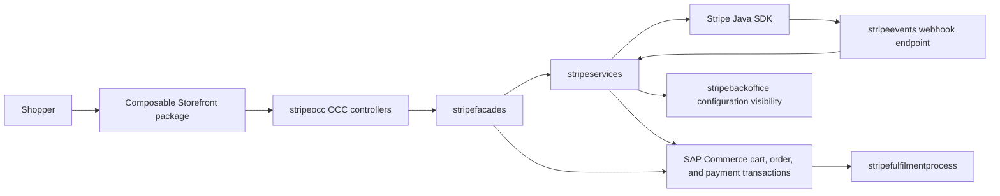

# Stripe Connector Documentation

This directory explains how the SAP Commerce Stripe Connector is organized and
how the main runtime flows move through Spartacus, OCC, the facade layer, the
service layer, Stripe, webhooks, and SAP Commerce order placement.

GitHub renders the Mermaid diagrams in these Markdown files automatically.

## Documents

- [Architecture](architecture.md): extension boundaries, dependency graph, and
  runtime layering.
- [Extension Reference](extension-reference.md): purpose and dependency summary
  for each SAP Commerce extension.
- [Configuration](configuration.md): required properties, site overrides,
  public configuration, and secret handling.
- [OCC API](occ-api.md): checkout session, PaymentIntent, configuration, and
  refund endpoints.
- [Hosted Checkout Flow](hosted-checkout-flow.md): hosted Stripe Checkout
  creation, redirect, return, finalize, and cancel behavior.
- [Payment Elements Flow](payment-elements-flow.md): inline Payment Elements
  creation, confirmation, return, and finalize behavior.
- [Webhooks](webhooks.md): Stripe event verification, dispatch, and local
  forwarding.
- [Refunds](refunds.md): order-bound refund flow and ownership checks.
- [Payment State and Order Placement](payment-state-and-order-placement.md):
  transaction entries, order status updates, fulfilment hooks, and process
  behavior.
- [Method Call Sequences](method-call-sequences.md): method-level sequence
  diagrams for the important calls.
- [Storefront Integration](storefront-integration.md): Spartacus module,
  routes, services, and checkout component wiring.
- [Installation and Deployment](installation-and-deployment.md): local
  installation, installer recipe, Commerce Cloud deployment notes, and
  webhook forwarding.
- [Testing](testing.md): implemented test surfaces and scenario coverage.
- [Troubleshooting](troubleshooting.md): practical failure diagnosis for
  configuration, redirects, webhooks, order placement, and refunds.

## High-Level Runtime Map

## Supported Payment Capabilities

The connector supports hosted Stripe Checkout, Stripe Payment Elements,
Stripe webhook processing, payment lifecycle state synchronization, order-bound
refunds, SAP Commerce transaction persistence, fulfilment-process payment
checks, backoffice configuration visibility, and SAP Composable Storefront
checkout and return routes.

## Source Anchors

The main implementation anchors are:

- `hybris/bin/modules/stripe/stripeocc/src/.../controllers`
- `hybris/bin/modules/stripe/stripefacades/src/...`
- `hybris/bin/modules/stripe/stripeservices/src/...`
- `hybris/bin/modules/stripe/stripeevents/src/...`
- `hybris/bin/modules/stripe/stripefulfilmentprocess/src/...`
- `hybris/bin/modules/stripe/stripebackoffice/src/...`
- `js-storefront/stripe-spartacus-connector/src/lib/stripe-checkout`
