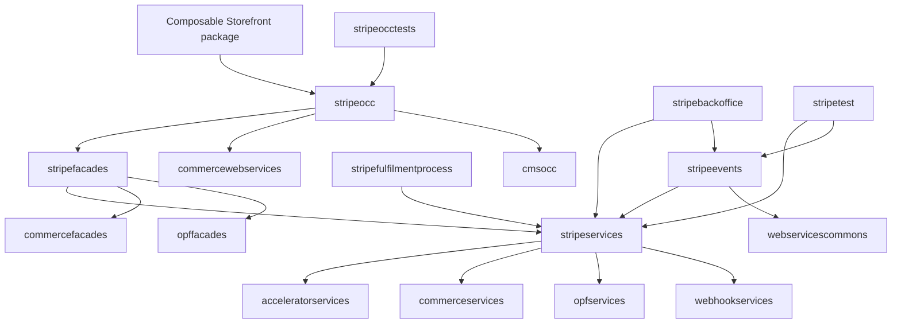
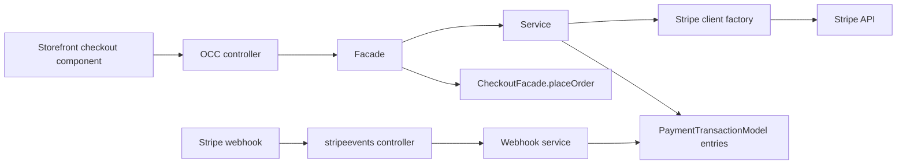

# Architecture

The connector follows the standard SAP Commerce extension layering pattern.
Stripe-specific provider calls and transaction persistence live in
`stripeservices`; checkout orchestration lives in `stripefacades`; OCC exposes
the facade contract in `stripeocc`; webhook HTTP handling lives in
`stripeevents`; payment-process integration lives in
`stripefulfilmentprocess`; and operational visibility lives in
`stripebackoffice`.

## Extension Dependency Graph

## Runtime Layers

| Layer | Extension or package | Responsibility |
| --- | --- | --- |
| Storefront | `js-storefront/stripe-spartacus-connector` | Replaces the checkout payment CMS component, starts hosted Checkout or Payment Elements, handles return routes, calls OCC finalize endpoints, and routes to order confirmation. |
| OCC | `stripeocc` | Exposes frontend-safe endpoints for Checkout Sessions, PaymentIntents, public config, finalization, cancellation, and refunds. |
| Facade | `stripefacades` | Resolves SAP Commerce checkout context, protects cart and order ownership, converts service data to facade data, and places or returns orders after Stripe confirms payment. |
| Service | `stripeservices` | Builds Stripe SDK requests, reads configuration, validates metadata ownership, persists SAP Commerce payment transactions, updates payment status, and processes webhook events. |
| Webhook | `stripeevents` | Owns `/stripeevents/webhooks/stripe` and delegates signature verification plus event dispatch to `stripeservices`. |
| Fulfilment | `stripefulfilmentprocess` | Synchronizes Stripe payment entries after order placement and checks payment state in the order process. |
| Backoffice | `stripebackoffice` | Displays connector configuration status with masked secret values and site-aware property resolution. |

## Main Flow Boundaries

The storefront never receives secret keys. It receives only publishable keys,
client secrets for Payment Elements, return URLs, public payment option
identifiers, and current payment state.

## Extension Roles

`stripeservices` is the source of truth for Stripe provider interaction. It
creates Checkout Sessions, creates or updates PaymentIntents, expires sessions,
cancels intents, creates refunds, verifies webhooks, and writes SAP Commerce
payment transaction entries.

`stripefacades` is the checkout orchestration boundary. It resolves the active
cart or already-created order and calls SAP Commerce order placement only after
the Stripe object is finalizable.

`stripeocc` is the public HTTP API boundary for the storefront. It loads the
cart context for authenticated and anonymous OCC users and maps facade data to
OCC DTOs.

`stripeevents` keeps webhook routing separate from OCC. The webhook endpoint is
not an OCC user endpoint; it accepts Stripe callbacks, verifies the signature,
and lets service-layer dispatch update local payment state.

`stripefulfilmentprocess` integrates payment state into SAP Commerce process
execution. It also registers the `StripePaymentPlaceOrderMethodHook` so Stripe
payment entries created on the cart are synchronized to the resulting order.

`stripebackoffice` is operational, not payment-critical. It surfaces whether
required configuration values are present and masks sensitive values.

## Metadata Contract

Stripe objects created by this connector carry metadata used by webhook
dispatch and ownership validation:

- `orderCode`: SAP Commerce cart or order code.
- `siteUid`: SAP Commerce base site.
- `orderType`: SAP Commerce model type.
- `paymentFlow`: `checkout` for hosted Checkout and `elements` for Payment
  Elements.

The same identifiers are also persisted in `PaymentTransactionEntryModel`
request ids so the connector can find a cart or order by Stripe request
reference.
