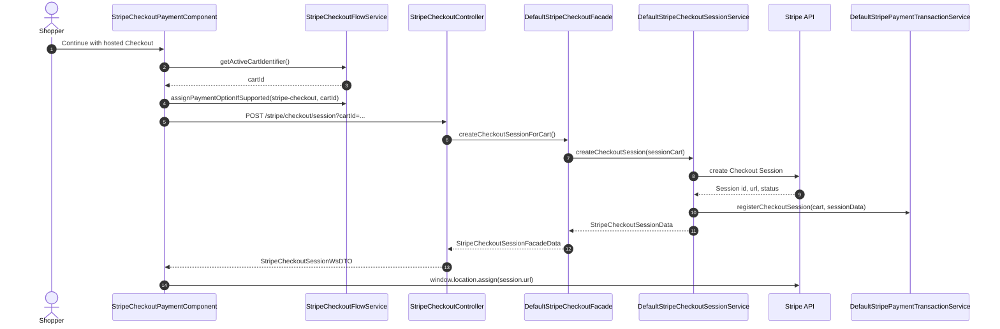
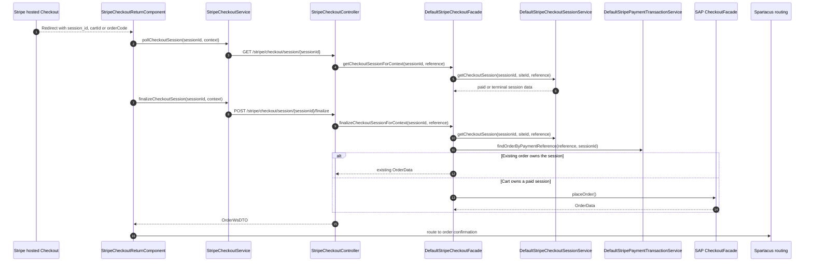
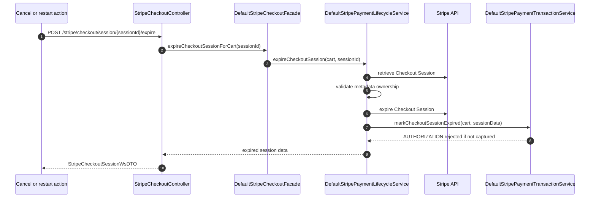

# Hosted Checkout Flow

Hosted Checkout redirects the shopper from Spartacus to a Stripe-hosted payment
page. After Stripe redirects back, the storefront calls the connector finalize
endpoint to place or retrieve the SAP Commerce order.

## Create and Redirect

The service builds the Checkout Session with:

- `mode=payment`
- one line item for the SAP Commerce order total
- `clientReferenceId` set to the cart code
- success and cancel URLs with cart/order context parameters
- metadata for `orderCode`, `siteUid`, `orderType`, and `paymentFlow=checkout`
- card payment method type

## Return and Finalize

The return component does not call the generic OCC order placement endpoint.
It calls the Stripe finalize endpoint so the connector can re-check Stripe
state and local ownership first.

## Cancel or Restart

## Finalizable State

The hosted Checkout facade finalizes only when the retrieved session is ready
for order placement. The implementation treats paid or complete Checkout
Session state as finalizable and rejects a session that is still pending or
unpaid.
