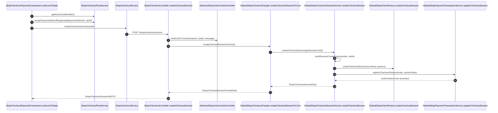
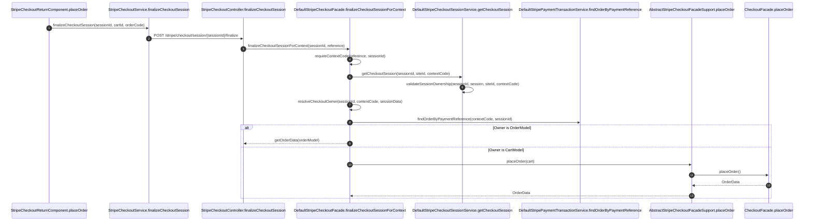
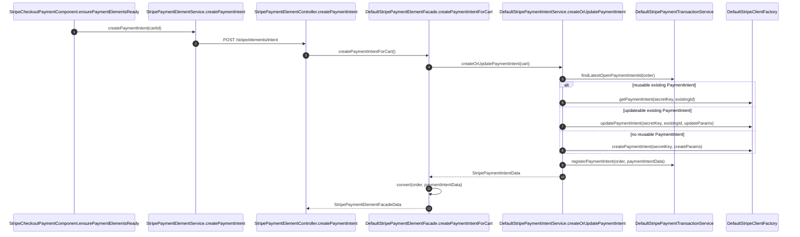
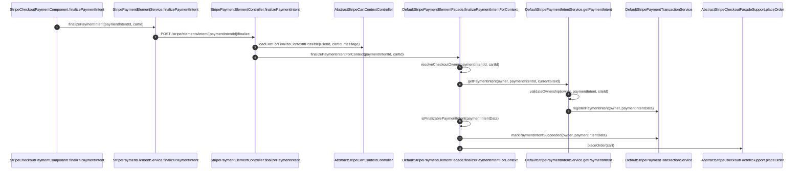
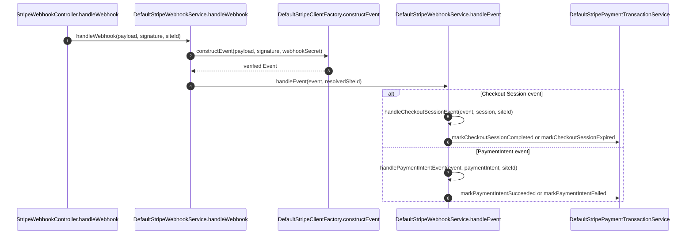
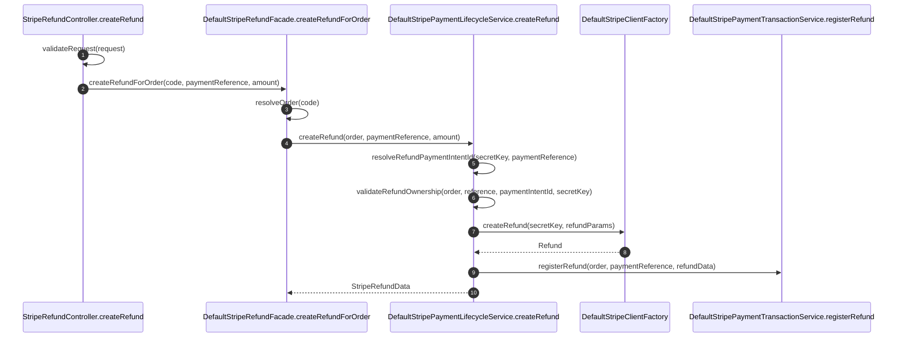

# Method Call Sequences

This page focuses on method-level calls between the main classes. The diagrams
use implementation names so maintainers can move from the docs to the code
quickly.

## Hosted Checkout Session Creation

## Hosted Checkout Finalize

## PaymentIntent Creation or Reuse

## PaymentIntent Finalize

## Webhook Dispatch

## Refund Creation

