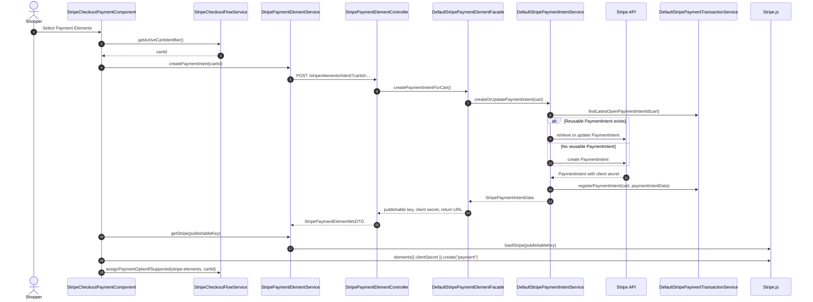
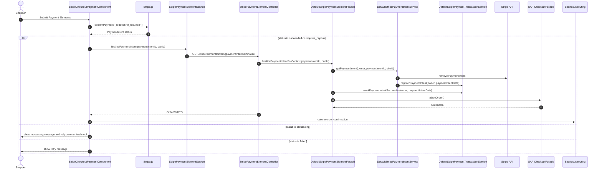
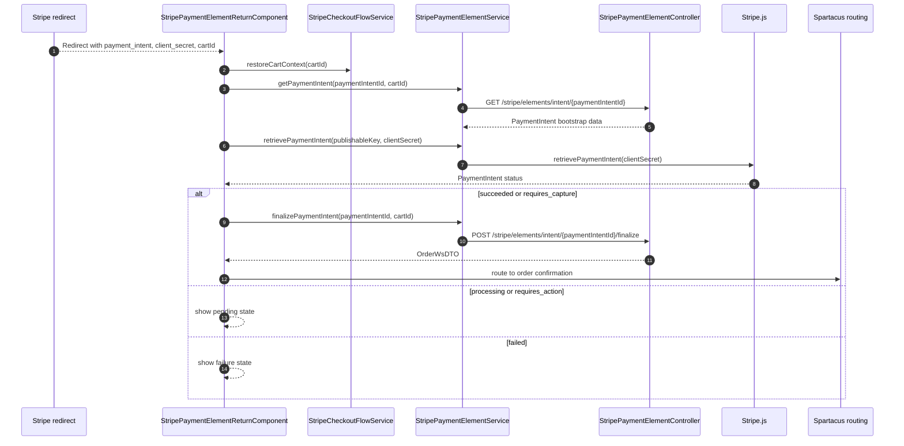

# Payment Elements Flow

Payment Elements keeps the shopper on the storefront while Stripe.js collects
and confirms payment details. The storefront must still call the connector
finalize endpoint after Stripe confirms the PaymentIntent.

## Prepare and Mount Elements

The PaymentIntent service creates or updates the intent with:

- order total in minor units
- currency
- order description
- automatic payment methods enabled
- receipt email when available
- metadata for `orderCode`, `siteUid`, `orderType`, and `paymentFlow=elements`

## Confirm Without Redirect

Stripe.js performs the browser-side confirmation. SAP Commerce order placement
still happens server-side through the finalize endpoint.

## Redirect Return Path

## Finalizable State

The storefront treats `succeeded` and `requires_capture` as successful
PaymentIntent statuses. The facade re-fetches the PaymentIntent server-side and
validates ownership before marking the SAP Commerce transaction as accepted and
placing the order.
