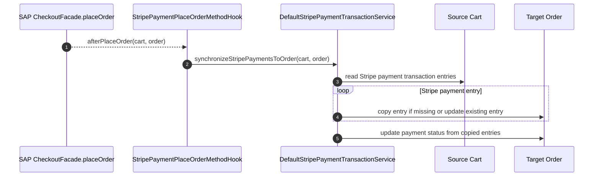
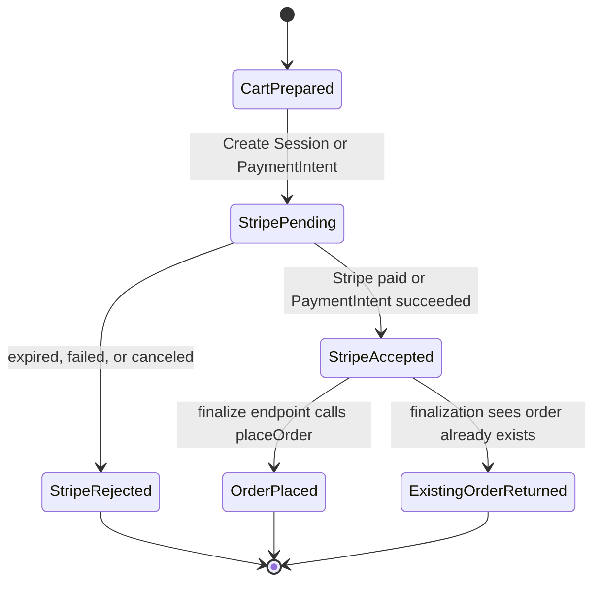
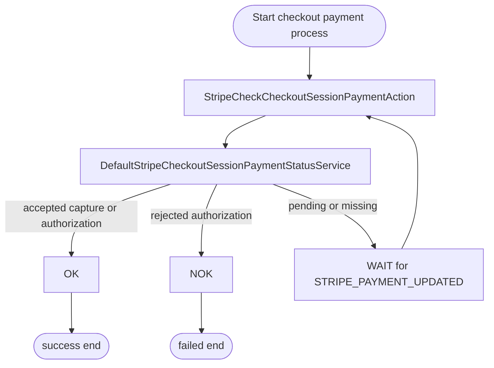

# Payment State and Order Placement

The connector persists Stripe payment state in SAP Commerce
`PaymentTransactionModel` and `PaymentTransactionEntryModel` records. Stripe
request identifiers are stored in transaction entry request ids so checkout
finalization, webhook processing, and refunds can resolve the owning cart or
order.

## Transaction Entry Model

| Stripe action | Entry type | Request id | Status |
| --- | --- | --- | --- |
| Checkout Session created | `AUTHORIZATION` | `cs_...` | `PENDING` |
| Checkout Session completed | `AUTHORIZATION` and `CAPTURE` | `cs_...` | `ACCEPTED` / `SUCCESSFUL` |
| Checkout Session expired | `AUTHORIZATION` | `cs_...` | `REJECTED` |
| PaymentIntent created or retrieved | `AUTHORIZATION` | `pi_...` | `PENDING` with Stripe status details |
| PaymentIntent succeeded | `AUTHORIZATION` and `CAPTURE` | `pi_...` | `ACCEPTED` with Stripe status details |
| PaymentIntent failed | `AUTHORIZATION` | `pi_...` | `REJECTED` |
| PaymentIntent canceled | `AUTHORIZATION` and `CANCEL` | `pi_...` | `REJECTED` then `ACCEPTED` cancel entry |
| Refund created | `REFUND_FOLLOW_ON` | `re_...` | mapped from Stripe refund status |

## Order Status Updates

When a capture entry exists with accepted status, the order is marked
`PAYMENT_CAPTURED`. When a rejected authorization exists without capture, the
order can be marked `PAYMENT_NOT_CAPTURED`.

## Cart to Order Synchronization

The order placement hook exists because Stripe payment entries are usually
created while the checkout is still a cart. Once SAP Commerce places the order,
the relevant Stripe entries must also exist on the order.

## Finalization State Machine

## Fulfilment Process Payment Check

The `stripefulfilmentprocess` extension includes a checkout payment process
that waits for Stripe payment updates. The payment status service checks
whether relevant payment transaction entries are accepted, rejected, or still
pending and returns an OK, NOK, or WAIT transition.

## Idempotency Behavior

Transaction update methods check for existing accepted or rejected entries
before creating new ones. This keeps browser finalization and webhook updates
from duplicating capture, cancel, or refund entries when the same Stripe event
is observed through multiple paths.
