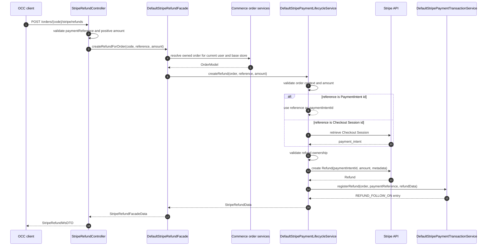

# Refunds

Refunds are order-bound and exposed through the `stripeocc` refund endpoint.
The caller must provide an owned order code or guest order guid plus a Stripe
payment reference.

## Endpoint

```text
POST /{baseSiteId}/users/{userId}/orders/{code}/stripe/refunds
```

Request body:

```json
{
  "paymentReference": "cs_test_or_pi_test_reference",
  "amount": 12.34
}
```

`amount` is optional and is expressed in major units. If omitted, Stripe creates
a full refund for the resolved PaymentIntent.

## Refund Sequence



## Ownership Rules

The refund facade resolves the order in the current base store. For anonymous
checkout it uses guest order details by guid. For registered customers it uses
the current customer and base store.

The lifecycle service validates that the payment reference belongs to the
order. It accepts:

- A direct PaymentIntent reference already present on the order transaction.
- A Checkout Session reference already present on the order transaction.
- A Checkout Session on the order whose provider-side PaymentIntent matches
  the resolved refund PaymentIntent.

## Transaction State

Refunds are stored as `REFUND_FOLLOW_ON` payment transaction entries. The entry
request id is the Stripe refund id. The request token stores the original
payment reference supplied by the caller.

## Partial Refunds

When `amount` is provided, the connector converts it from major units into
minor units using the order currency digits before calling Stripe.
