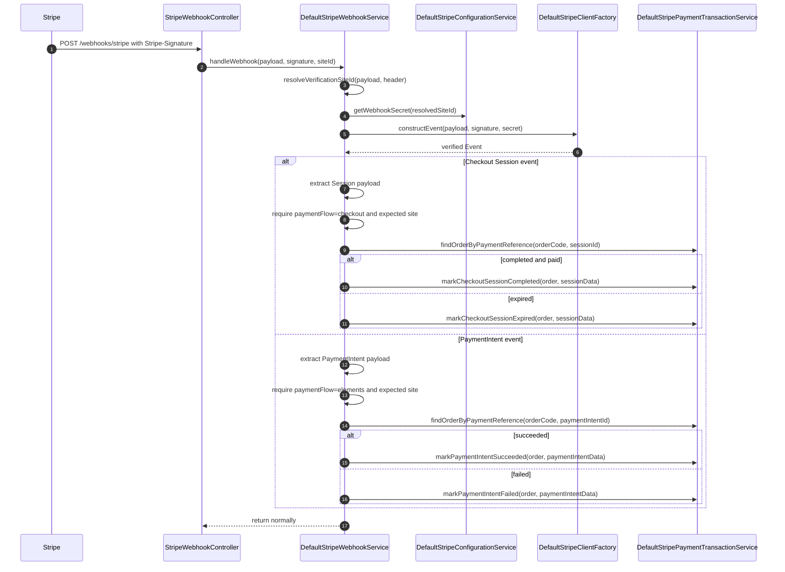

# Webhooks

Stripe webhooks are handled by the `stripeevents` extension and processed in
the `stripeservices` service layer.

## Endpoint

The webhook controller exposes:

```text
POST /stripeevents/webhooks/stripe
```

Required header:

```text
Stripe-Signature
```

Optional header:

```text
X-Base-Site-Id
```

The connector can also resolve the site from Stripe payload metadata, so the
base-site header is optional for the local happy path.

## Local Forwarding

Prefer plain HTTP to the local SAP Commerce app server:

```bash
stripe listen --forward-to http://127.0.0.1:9001/stripeevents/webhooks/stripe
```

If only HTTPS is available locally:

```bash
stripe listen --skip-verify --forward-to https://127.0.0.1:9002/stripeevents/webhooks/stripe
```

## Supported Events

| Stripe event | Flow | Local effect |
| --- | --- | --- |
| `checkout.session.completed` | Hosted Checkout | Marks the Checkout Session authorization accepted and creates a capture entry when needed. |
| `checkout.session.expired` | Hosted Checkout | Marks the Checkout Session authorization rejected when it was not captured. |
| `payment_intent.succeeded` | Payment Elements | Marks the PaymentIntent authorization accepted and creates a capture entry when needed. |
| `payment_intent.payment_failed` | Payment Elements | Marks the PaymentIntent authorization rejected. |
| `payment_intent.canceled` | Payment Elements | Marks the PaymentIntent authorization rejected through the failed-event path. |

## Webhook Processing Sequence



## Signature Verification

`DefaultStripeWebhookService` asks `DefaultStripeClientFactory` to construct the
Stripe event with the configured webhook secret. A failed signature raises a
`StripeIntegrationException`.

## Site and Flow Guarding

Webhook events are ignored when metadata does not match the expected payment
flow and site:

- Hosted Checkout events require `paymentFlow=checkout`.
- Payment Elements events require `paymentFlow=elements`.
- The resolved site must match event metadata or the connector's expected site
  resolution.

This prevents a Checkout Session event from mutating a Payment Elements
transaction and prevents cross-site events from mutating the wrong SAP Commerce
order.
